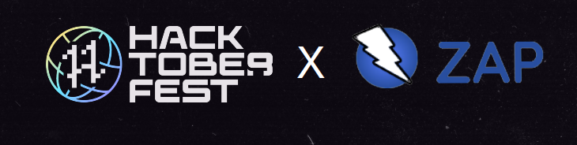

We are happy to announce that ZAP is participating in [Hacktoberfest](https://hacktoberfest.com/) 2022.

## Contributors
This is what contributors need to know to participate and complete Hacktoberfest 2022:
- Register anytime between September 26 and October 31.
- Contributions/pull requests can be made to the following repositories under the [OWASP ZAP](https://github.com/zaproxy) organization:
    - ZAP Core: [link](https://github.com/zaproxy/zaproxy)
    - ZAP Extensions: [link](https://github.com/zaproxy/zap-extensions)
    - ZAP HUD: [link](https://github.com/zaproxy/zap-hud)
    - ZAP Core Help: [link](https://github.com/zaproxy/zap-core-help)
    - ZAP Community Scripts: [link](https://github.com/zaproxy/community-scripts)
    - ZAP Website: [link](https://github.com/zaproxy/zaproxy-website)
    - ZAP API Docs: [link](https://github.com/zaproxy/zap-api-docs)
- Read the [ZAP Contributing Guide](https://www.zaproxy.org/docs/contribute/).
- We recommend you to go through [ZAP Development guide](https://www.zaproxy.org/docs/developer/), it has all the answers to your questions about the development environment setup and the verifications you must perform before your PR is merged. 
- If you are beginner, we recommend you to try out the curated [hacktoberfest issues](https://github.com/zaproxy/zaproxy/issues?q=is%3Aopen+is%3Aissue+label%3AHacktoberFest) we have for you. 
- If you would like to tackle a bit more challenging ones, you can check out the [good second issues](https://github.com/zaproxy/zaproxy/issues?q=is%3Aopen+is%3Aissue+label%3A%22good+second+issue%22) and [enhancement](https://github.com/zaproxy/zaproxy/issues?q=is%3Aopen+is%3Aissue+label%3Aenhancement) issues.
- Have 4 pull requests accepted between October 1 and October 31.
- The first 40,000 participants (maintainers and contributors) who successfully complete Hacktoberfest can elect to receive one out of two prizes: a tree planted in their name, or the Hacktoberfest 2022 t-shirt. We would greatly appreciate if you would pick the "plant a tree in your name" option.

Some good resources to get started for beginners:
 - Open Source Guides: [How to contribute to Open Source](https://opensource.guide/how-to-contribute/)
 - GitHub: [GitHub training kit](https://github.github.com/training-kit/)
 - DigitalOcean: [Introduction to Open Source](https://www.digitalocean.com/community/tutorial_series/an-introduction-to-open-source)
 - GitHub: [Write good PRs](https://github.blog/2015-01-21-how-to-write-the-perfect-pull-request/)