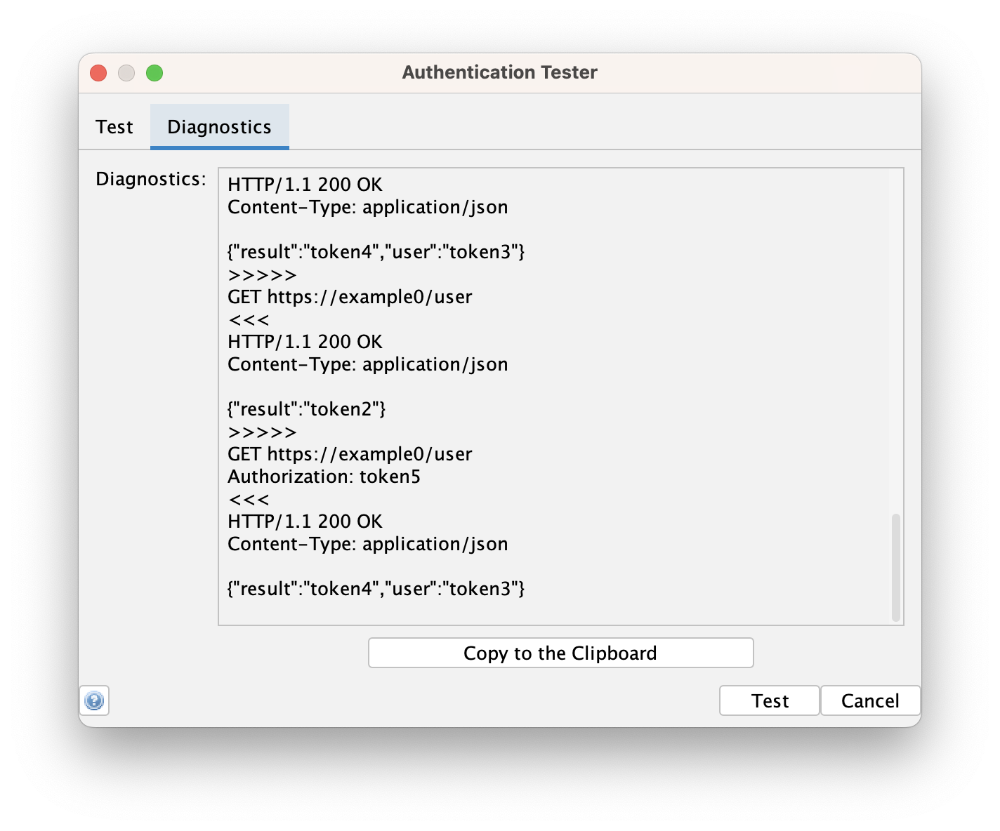

ZAP can now automatically handle many types of authentication as detailed in the 
[Authentication Auto-Detection](/blog/2023-05-02-authentication-auto-detection/) blog post.

However it did mean you had to create an [Automation Framework](/docs/automate/automation-framework/) plan via the command line, which is not ideal.

It is now _much_ easier to test if ZAP can handle your app's authentication with a brand new dialog!

## Authentication Tester Dialog

The [Authentication Helper](/docs/desktop/addons/authentication-helper/) add-on now adds a new Authentication Tester dialog which can be accessed via the Tools menu item or the key combination: <Control> T. 

You only need to specify the following fields:

* Login URL
* Username
* Password

The rest can be left as their defaults.

When you press the "Test" button then ZAP will:

1. Launch the browser you have specified (by default Firefox)
1. Load the Login URL
1. Attempt to fill in the Login form
1. Validate that it can detect the session handling
1. Validate that it can find a suitable verification URL
1. Report how far it has got

For more details about the dialog see the [help](/docs/desktop/addons/authentication-helper/auth-tester/) page.

## What if it Doesn't Work?

The ZAP authentication auto-detection should handle the majority of login pages, but what can you do if it cannot handle your login page?

First of all it depends where it fails.

If ZAP fails to connect to your website then you have a networking issue, and we have a 
[FAQ](/faq/why-cant-zap-connect-to-my-website/) for that.

If ZAP cannot identify either the Username or Password field then we'll need to know more details.
Ideally you will be able to share a publicly accessible URL with us - we don't need to know the credentials.
If you cannot share a URL we can access then a minimal example page would be just as good.
Failing that please [get in touch](https://groups.google.com/group/zaproxy-users) and we'll discuss what options we have.

If ZAP fails to identify the session handling or find a verification URL then we have another option - the Diagnostics tab:

This is a sanitised summary of the requests and responses made - we just collect essential information and replace host names
and key values with safe tokens.

You can double check that this does not include anything sensitive and then share that with us.

## Give Us Feedback

Try it out and let us know how you get on!

Obviously we'd love to hear about the successes, but we do also want to know as many details as possible about the failures
so that we can fix them.

## Sponsored by Jit

A big thank you to our Platinum sponsor [Jit](https://www.jit.io/zap?utm_source=zapproxy&utm_medium=banner&utm_campaign=zap-proxy-website-banner) who have sponsored this and all of the other recent work on ZAP authentication.

